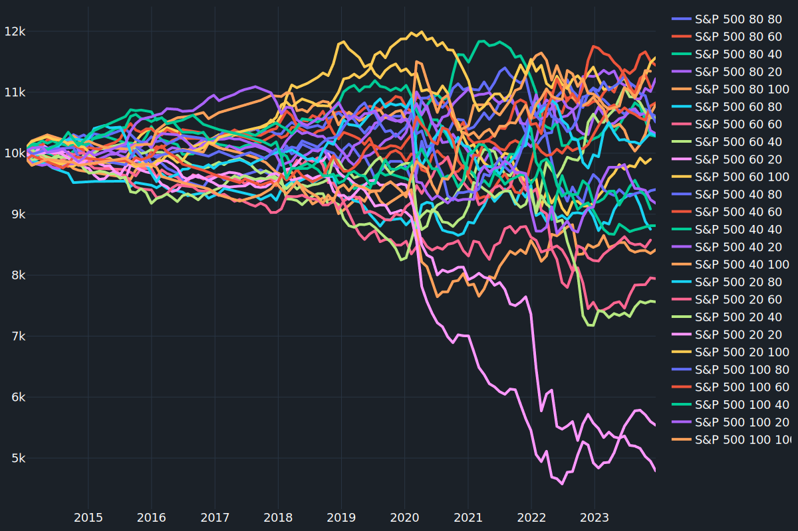

## C# Backtesting Engine

### Active development

Working build! Requires local tick data. Evaluate locally with `dotnet test` - 49 tests should pass, 1 skipped 

## About The Project

I'm developing a high-performance C# backtesting engine designed to analyze financial data and evaluate multiple trading strategies at scale.

[](https://sonarcloud.io/summary/overall?id=mccaffers_backtesting-engine) [](https://github.com/mccaffers/backtesting-engine/actions/workflows/build.yml) [](https://sonarcloud.io/summary/new_code?id=mccaffers_backtesting-engine) [](https://sonarcloud.io/summary/new_code?id=mccaffers_backtesting-engine)


I'm extracting results and creating various graphs for trend analyses using SciPy for calculations and Plotly for visualization.



*Read more results on https://mccaffers.com/randomly_trading/*

### Features

* Multiple symbol ingest with time synchronisation
* xUnit testing 
* Trade Environment
    * Trade Excution
    * Equity Monitoring
* Reporting (ElasticSearch)

### Getting Started

#### Testing
`dotnet test`

#### Local Terminal
sh ./scripts/backtesting/run.sh

#### Local Web & Terminal
sh ./scripts/backtesting/web.sh

### Dependencies

* dotnet v8
  * Charting & Web use, need to accept dotnet's certificates `dotnet dev-certs https --trust`
* ElasticSearch for reporting
* CanvasJS used for charting
  * JS libaries `canvasjs.min.js` to be placed within ./src/ui/src/libs/ folder
* Some financial tick data in CSV format, in the /src/tickdata folder (example provided)

    ```bash
    # ./tickdata/{symbol}/2020.csv:
    UTC,AskPrice,BidPrice,AskVolume,BidVolume
    2018-01-01T01:00:00.594+00:00,1.35104,1.35065,1.5,0.75
    ```

### Debugging
If you have changed target frameworks, make sure to update the program path in .vscode `launch.json`

### Random Trading Strategy
    accountEquity=0
    maximumDrawndownPercentage=0

### License
[MIT](https://choosealicense.com/licenses/mit/)
